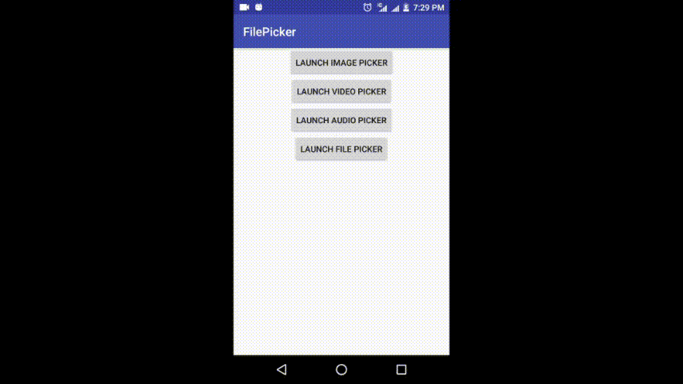

# FilePicker Library for Android

[](https://opensource.org/licenses/Apache-2.0)
[](https://android-arsenal.com/api?level=14)
[](https://jitpack.io/#jaiselrahman/FilePicker)
[](https://android-arsenal.com/details/1/7002)

A FilePicker library for Android for selecting multiple types of files and also to capture Images and Videos.

[Sample Apk](https://github.com/jaiselrahman/FilePicker/releases/download/1.1.0/app-release.apk)

## Note

* Uses [MediaStore](https://developer.android.com/reference/android/provider/MediaStore) Database for loading files info.
* Uses [Glide](https://github.com/bumptech/glide) for loading images.

## [Screenshots](pics/)



## Usage

Step 1: Add it in your root build.gradle at the end of repositories

```gradle
    allprojects {
        repositories {
            ...
            maven { url 'https://jitpack.io' }
        }
    }
```

Step 2: Add the dependency

```gradle
    dependencies {
        ...
        implementation 'com.github.jaiselrahman:FilePicker:1.1.0'
    }
```

Step 3: Start FilePickerActivity using ```startActivityForResult(...)```.

```java
    Intent intent = new Intent(this, FilePickerActivity.class);
    startActivityForResult(intent, FILE_REQUEST_CODE);
```

Step 4: Receive results in ```onActivityResult(...)```.

```java
    case FILE_REQUEST_CODE:
        ArrayList<MediaFile> files = data.getParcelableArrayListExtra(FilePickerActivity.MEDIA_FILES);
        //Do something with files
        break;
```

## Configuration

The FilePickerActivity can be configured by using ```Configurations.Builder``` methods

### Example

```java
    intent.putExtra(FilePickerActivity.CONFIGS, new Configurations.Builder()
                .setCheckPermission(true)
                .setShowImages(true)
                .enableImageCapture(true)
                .setMaxSelection(10)
                .setSkipZeroSizeFiles(true)
                .build());
```

### Builder Methods

|Methods|Default value|Uses|
|-------|-------|---|
|setShowImages(boolean)|true|Whether to load Images files|
|setShowVideos(boolean)|true|Whether to load Videos files|
|setShowAudios(boolean)|false|Whether to load Audio files|
|setShowFiles(boolean)|false|Whether to load Files for given suffixes|
|enableImageCapture(boolean)|false|Enables camera for capturing of images|
|enableVideoCapture(boolean)|false|Enables camera for capturing of videos|
|setCheckPermission(boolean)|false|Whether to request permissions on runtime for API >= 23 if not granted|
|setSuffixes(String...)|"txt", "pdf", "html", "rtf", "csv", "xml",<br/>"zip", "tar", "gz", "rar", "7z","torrent",<br/>"doc", "docx", "odt", "ott",<br/>"ppt", "pptx", "pps",<br/>"xls", "xlsx", "ods", "ots"|Suffixes for file to be loaded, overrides default value|
|setMaxSelection(int)|-1|Maximum no of items to be selected, -1 for no limits|
|setSingleChoiceMode(boolean)|false|Can select only one file, overrides `setMaxSelection(int)` <br/> use `setSelectedMediaFile(MediaFile)` to set default selection|
|setSelectedMediaFile(MediaFile)|null|Default file selection in singleChoiceMode|
|setSelectedMediaFiles(ArrayList\<MediaFile\>)|null|Default files to be marked as selected|
|setSingleClickSelection(boolean)|true|Start selection mode on single click else on long click|
|setSkipZeroSizeFiles(boolean)|true|Whether to load zero byte sized files|
|setLandscapeSpanCount(int)|5|Grid items in landscape mode|
|setPortraitSpanCount(int)|3|Grid items in portrait mode|
|setImageSize(int)|Screen width/portraitSpanCount |Size of height, width of image to be loaded in Px|
|setRootPath(String)|External storage|Set custom directory path to load files from|

## MediaFile methods

|Method|Description|
|------|-----------|
|long getId()|Id of the file in MediaStore database|
|String getName()|Name of file without suffix|
|String getPath()|Absolute path of the file|
|long getSize()|Size of the file|
|long getDate()|Date when file is added to MediaStore database|
|String getMimeType()|Mime type of the file|
|int getMediaType()|One of TYPE_FILE, TYPE_IMAGE, TYPE_AUDIO, TYPE_VIDEO|
|long getDuration()|Duration of Audio, Video files in ms, else 0|
|Uri getThumbnail()|Album Art of Audio files|
|long getHeight()|Height of Image, Video files in Px for API>=16, else 0|
|long getWidth()|Width of Image, Video files in Px for API>=16, else 0|
|String getBucketId()|Id of Parent Directory in MediaStore database|
|String getBucketName()|Name of Parent Directory|

## Contributions

Feel free to contribute to this project. Before creating issues or pull request please take a look at following templates.

* [Bug report template](.github/ISSUE_TEMPLATE/bug_report.md)
* [Feature request template](.github/ISSUE_TEMPLATE/feature_request.md)
* [Pull Request template](.github/PULL_REQUEST_TEMPLATE.md)

## Credits

* Inspired by [MultiType-FilePicker](https://github.com/fishwjy/MultiType-FilePicker)

## License

    Copyright (c) 2018, Jaisel Rahman

    Licensed under the Apache License, Version 2.0 (the "License");
    you may not use this file except in compliance with the License.
    You may obtain a copy of the License at

     http://www.apache.org/licenses/LICENSE-2.0

    Unless required by applicable law or agreed to in writing, software
    distributed under the License is distributed on an "AS IS" BASIS,
    WITHOUT WARRANTIES OR CONDITIONS OF ANY KIND, either express or implied.
    See the License for the specific language governing permissions and
    limitations under the License.
